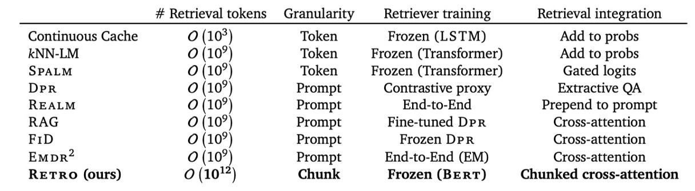
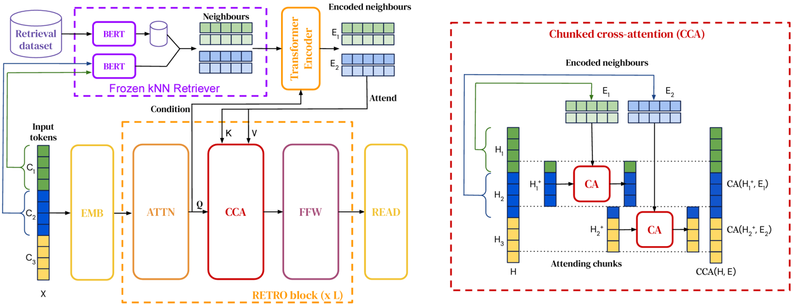
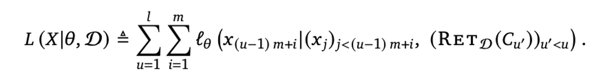
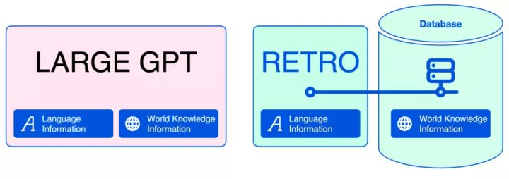
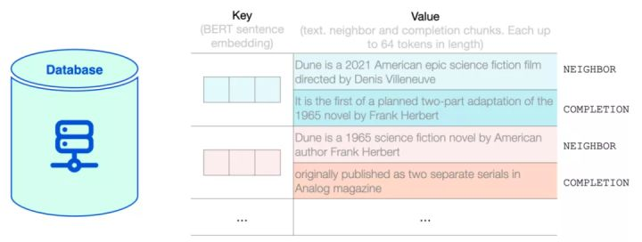
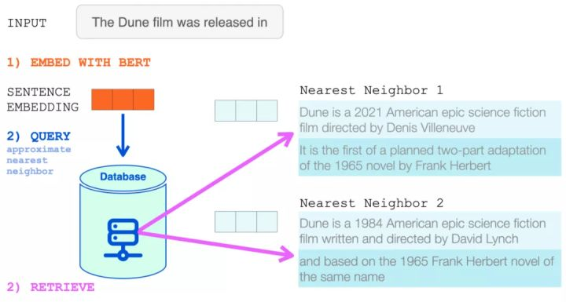
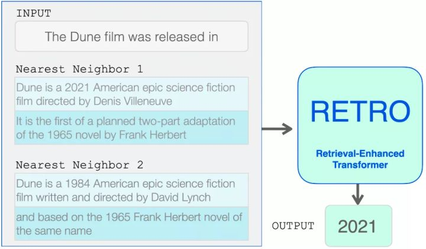
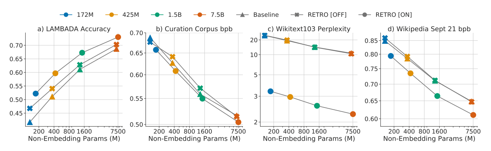

# Improving Language Models by Retrieving from Trillions of Tokens

## Overview

Retrieval-Enhanced Transformer, abbreviated to RETRO, is introduced by DeepMind in December 2021 with the latest revision in February 2022. This model's advantage is that it uses much less parameters to complete the same amount of tasks. Existing retrieval approaches are various, but RETRO applied several novel methods that highly improved its training time and modeling performance. Briefly, it used a tokenized retrieval database for text candidate search and use chunked cross-attention to minimize the encoding and decoding time.

Table 1: Comparison of RETRO with existing retrieval approaches.

## Architecture of RETRO

Figure 1: RETRO architecture

+ The left part shows the simplified version where a sequence of length n = 12 is split into l = 3 chunks of size m = 4.

+ For each chunk, the retrieved k = 2 neighbors of r = 5 tokens each are shown on top.

+ Details of the interactions in the Chunked Cross-attention operator is presented on the right.

+ Causality is maintained as neighbors of the first chunk only affect the last token of the first chunk and tokens from the second chunk.

### Retrieval-enhanced Autoregressive Token Models

The tokens' likelihood is calculated by a model:

+ Each n-token-long example X is splited into a sequence of l chunks signed C of size m = n/l. Here n = 2048 and m = 64.

+ Each chunk C is augmented with a set RET_D of k neighbors from the database D.

+ Then, nearest neighbor retrieval is performed and fed into bi-directional ENCODER.

### Retrieval Database

Figure 2: Comparison of Large GPT and RETRO

+ Traditional GPT model will be fed both language information and world knowledge information.

+ RETRO is fed only language information to train the basic language model, and then the world knowledge information is searched in a tokenized database.

+ The key of the database is standard BERT token, and the value contains two part, Neighbor and Completion.

Figure 3: The structure of the database

Therefore, the weight in the black box is revealed by the search of database. And with so, the number of parameters could be reduced.

## Use Case

+ Embed the input with BERT.

+ Query neighbors in the database.

+ Retrieve the results and feed into a transformer encoder

+ Feed both the input and results from the encoder into RETRO.

+ Get the output.

## Performance

The experiment was performed on Colossal Clean Crawled Corpus, Wikitext103, Curation Corpus, LAMBADA and Pile.

Figure 5: Scaling with respect to model size.

We can see the accuracy of RETRO on LAMBADA is top-1.

## Biases, Misinformation and Toxic Language

According to DeepMind, RETRO could help address this issue because it is easier to see what the AI has learned by examining the database than by studying the neural network.

In theory, this could allow examples of harmful language to be filtered out or balanced with non-harmful examples. But DeepMind has not yet tested this claim.

## Critical Analysis

This paper didn't provide the code they use. On Github I found an implementation given by Phil Wang, Joseph Cappadona and Mitchell Gordon. They claimed that it is only an example.

Besides, as the transformer encoder part is considered a language information processor, it is somehow freezed with no further training. The adjustment is made in the database.

## Discussion Topics

### Is search/query for information really faster than scaling larger models?

### Do you think freezing the pre-trained transformer (for language model) is good?

### Is the database really useful to solve ethical problems?

## Resource Links

1. https://www.deepmind.com/publications/improving-language-models-by-retrieving-from-trillions-of-tokens

2. https://github.com/lucidrains/RETRO-pytorch

## Video Recording

https://www.youtube.com/watch?v=-93KBOg77Sg&t=925s

## Code demo

[RETRO-pytorch](https://github.com/lucidrains/RETRO-pytorch)